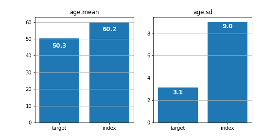
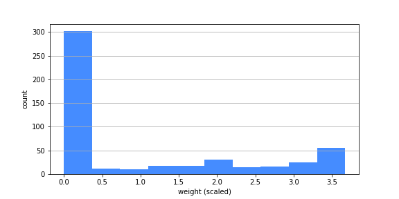
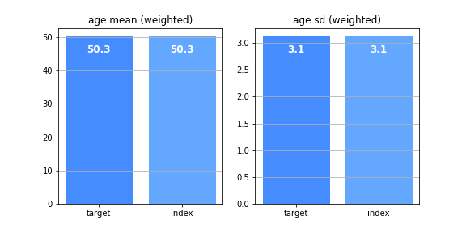

[logo]

---
[badges]

**indcomp** is a package for performing indirect treatment comparisons.

inccomp currently supports the Matching-Adjusted Indirect Comparison (MAIC) approach, implemented in line with [NICE's guidance](http://nicedsu.org.uk/technical-support-documents/population-adjusted-indirect-comparisons-maic-and-stc/).


## Install

<pre>
# PyPI
pip install indcomp
</pre>

### Dependencies
* NumPy
* SciPy
* pandas
* matplotlib

---

## Usage

```python
from indcomp import MAIC
from indcomp.datasets import load_NICE_DSU18

# load simulated Individual Patient Data (IPD) for trial AB
# load simulated Aggregated Data (AgD) for trial AC
df_AB_IPD, df_AC_AgD = load_NICE_DSU18()
print(df_AB_IPD.sample(5))
```
```console
>       ID  age  gender trt  y
> 411  162   61  Female   B  0
> 208  209   75    Male   A  1
> 356  107   51  Female   B  0
> 323   74   62  Female   B  0
> 236  237   65    Male   A  1
```
```python
print(df_AC_AgD.round(2))
```
```console
>    age.mean  age.sd  N.male  prop.male  y.A.sum  y.A.bar  N.A  y.C.sum  y.C.bar  N.C
> 0     50.27    3.12      68       0.23      125     0.83  150       21     0.14  150
```
```python
maic=MAIC(
    df_index=df_AB_IPD,
    df_target=df_AC_AgD,
    match={
        "age.mean": ("mean", "age"),  # adjust to have same age mean
        "age.sd": ("std", "age", "age.mean")  # adjust to have same age std
    }
)
maic.compare_populations()
```
<p align="center">
  
</p>

```python
maic.calc_weights()
print(f"Effective Sample Size: {maic.ESS_:.2f}")
maic.plot_weights()
```
```console
> Effective Sample Size: 178.56
```
<p align="center">
  
</p>

```python
maic.compare_populations(weighted=True)
```
<p align="center">
  
</p>